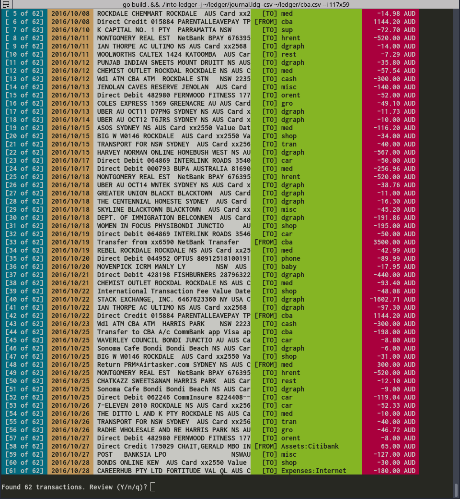
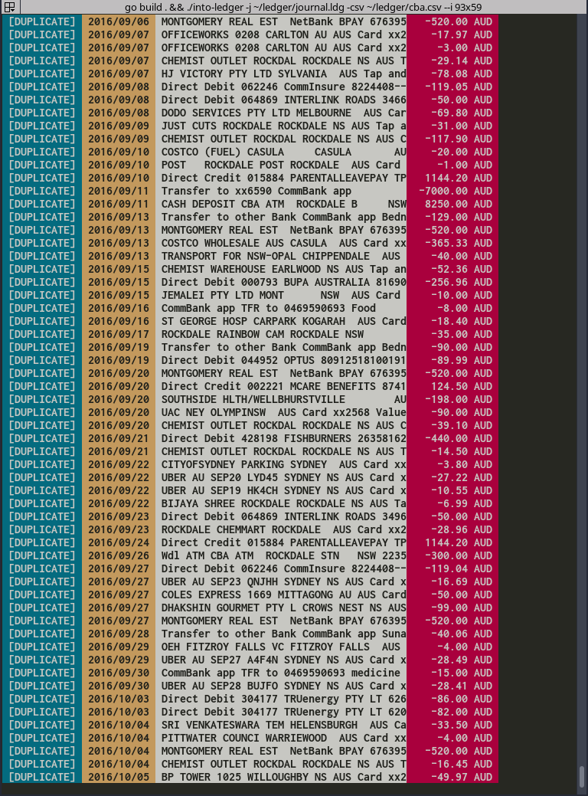
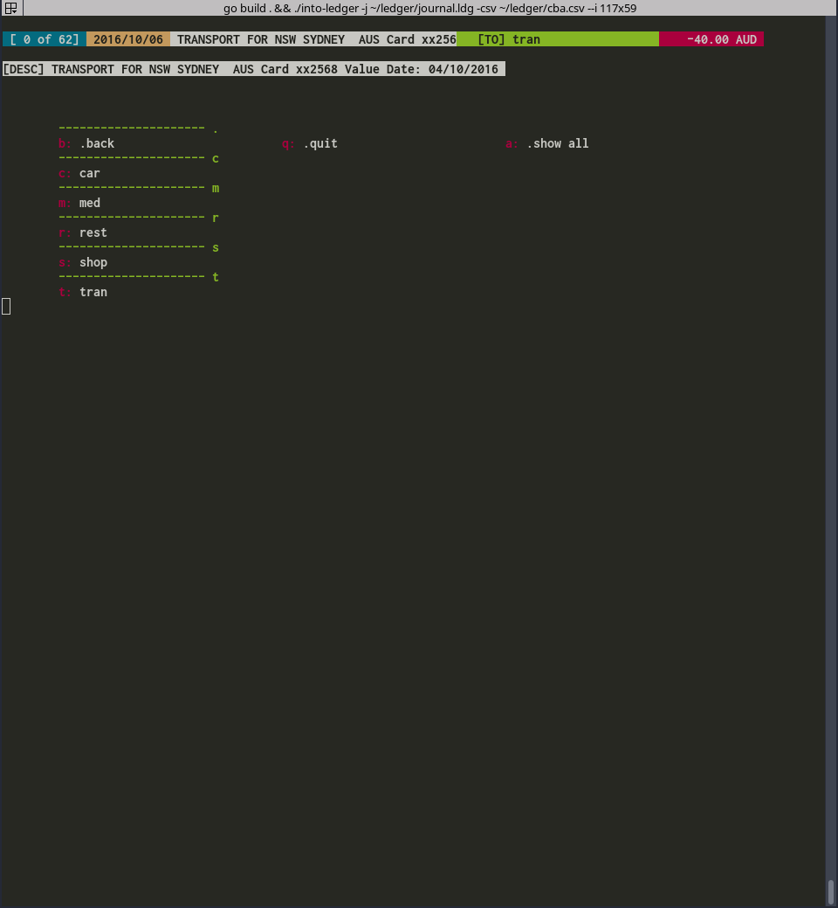

into-ledger
-----------
into-ledger helps categorization of CSV transactions and conversion into ledger format. It makes importing hundreds of transactions into ledger a breeze.

Features:
- Uses a much more accurate tf-idf expense classifier than used by cantino/reckon.
- Correctly parses your existing journal file, handling all includes and account aliases.
- Assigns dynamic keyboard shortcuts, so classifying transactions is just a keystroke away.
- Uses temporary storage (boltdb) to persist transactions that you have categorized or acknowledged to be correctly categorized, so you can quit whenver you want, without the risk of losing the work done so far.
- Deduplicates incoming transactions from CSV against the transactions already present in ledger journal. This allows an easy resume from a broken workflow.
- Colors and formatting, because it's not just about getting things done. It's also about making them look nice!


Install
-------
go get -v -u github.com/manishrjain/into-ledger


Help
----
$ into-ledger --help
Usage of into-ledger:
  -a string
    	Name of bank account transactions belong to.
  -c string
    	Set currency if any.
  -conf string
	    	Config file to store keyboard shortcuts in. (default "/home/mrjn/.into-ledger")
  -csv string
    	File path of CSV file containing new transactions.
  -d string
    	Defaults to MM/DD/YYYY. Express your date format w.r.t. Jan 02, 2006. See: https://golang.org/pkg/time/ (default "01/02/2006")
  -debug
    	Additional debug information if set.
  -ic string
    	Comma separated list of columns to ignore in CSV.
  -j string
    	Existing journal to learn from.
  -o string
    	Journal file to write to.


Usage
-----

```
# Importing from Citibank Australia
$ into-ledger -j ~/ledger/journal.ldg -csv ~/ledger/ACCT_464_25_07_2016.csv --ic "3,4" -o out.data -a citi -c AUD -d "02/01/2006"

# Importing from Chase USA
$ into-ledger -j ~/ledger/journal.ldg -csv ~/ledger/Activity.CSV --ic "0,1" -o out.data -a chase -c USD
```

Screenshots
-----------

**Parse transactions from CSV, and show automatically picked categories to be reviewed.**



**Detect duplicates transactions in CSV, which are already present in ledger journal.**



**Categorize transaction using persistent and dynamic keyboard shortcuts.**


